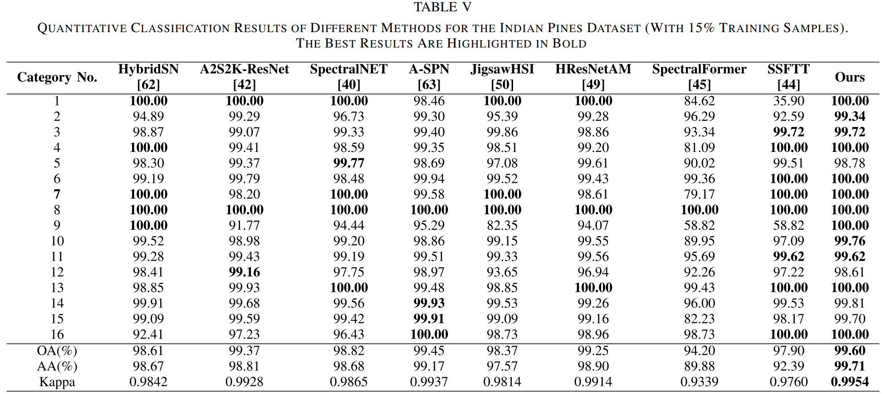
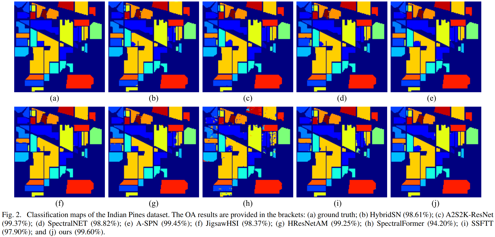
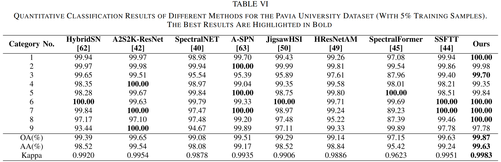
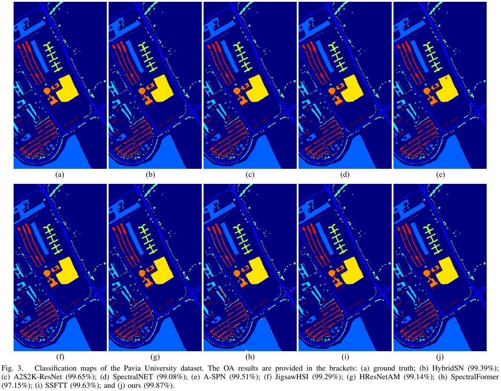
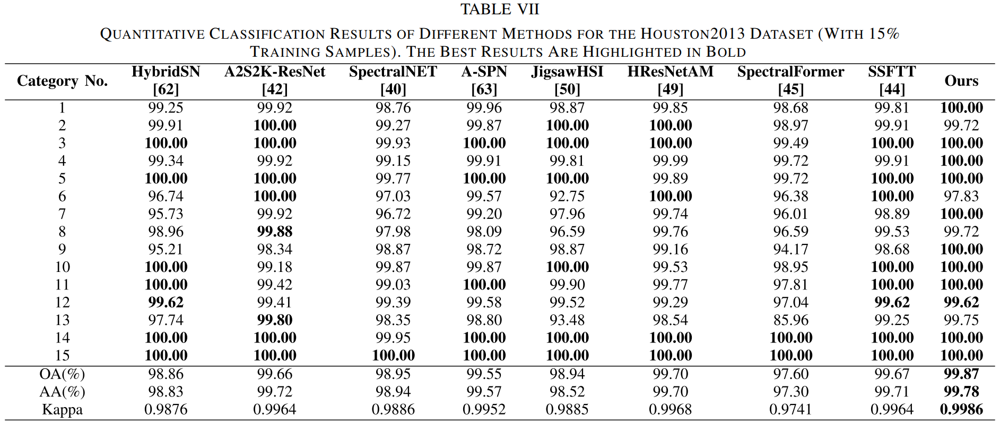
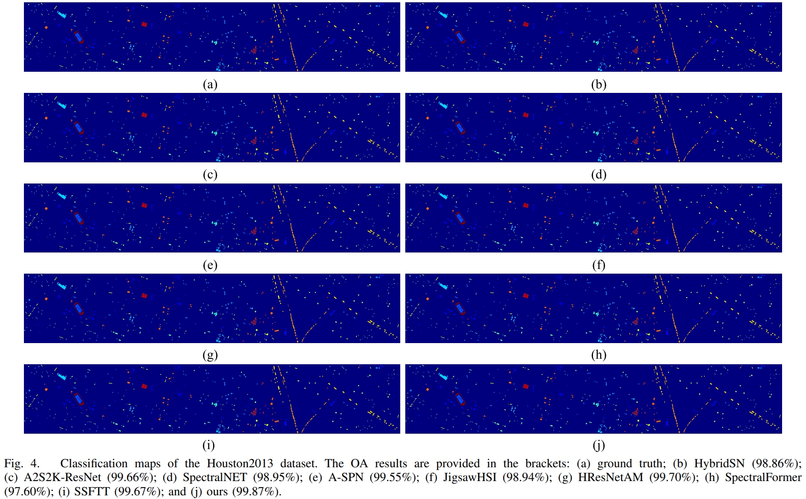
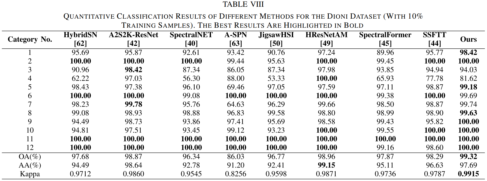
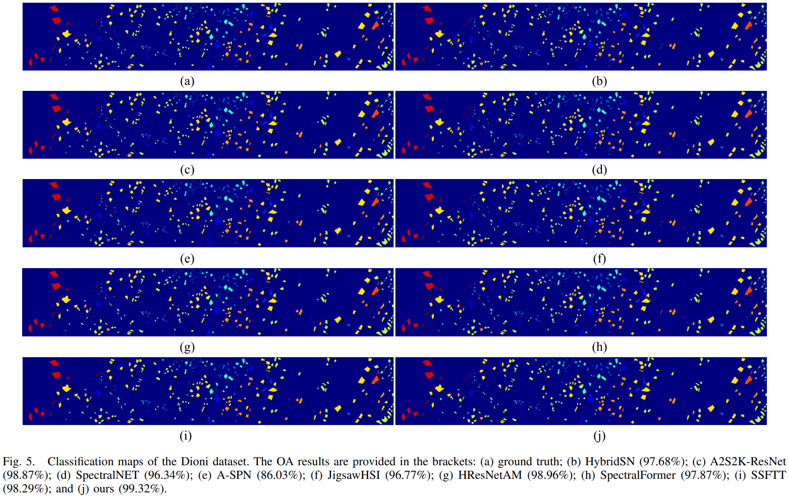
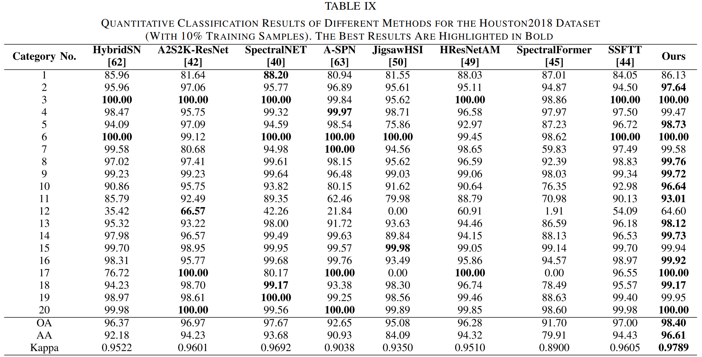
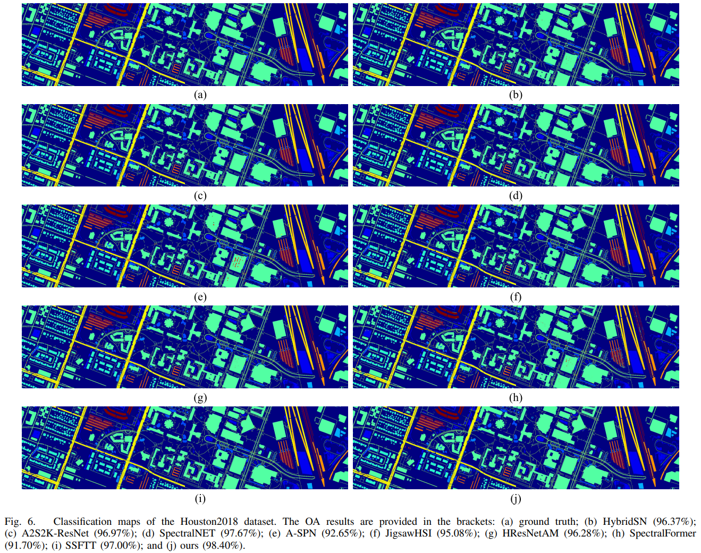

# CL-MGNet
Pytorch code for [Category-Level Band Learning-Based Feature Extraction for Hyperspectral Image Classification](https://ieeexplore.ieee.org/document/10360444), IEEE TGRS.

[Ying Fu](https://ying-fu.github.io/), Hongrong Liu, Yunhao Zou, Shuai Wang, Zhongxiang Li, and Dezhi Zheng.

## Citation
If you find this work useful for your research, please cite: 
```
@ARTICLE{10360444,
  author={Fu, Ying and Liu, Hongrong and Zou, Yunhao and Wang, Shuai and Li, Zhongxiang and Zheng, Dezhi},
  journal={IEEE Transactions on Geoscience and Remote Sensing}, 
  title={Category-Level Band Learning-Based Feature Extraction for Hyperspectral Image Classification}, 
  year={2024},
  volume={62},
  number={},
  pages={1-16},
  doi={10.1109/TGRS.2023.3340517}}
```

## Introduction
In this paper, we propose a novel HSI classification framework named CL-MGNet, which can fully exploit the category-specific properties in spectral bands and obtain features with multiscale spatial information and global spectral properties.


## Highlight
- An attention-based module SWL with a category consistency loss is designed for mining important spectral information and category-specific properties in spectral bands.
- To fully exploit the spatial correlation and contextual information between neighboring pixels in HSI, a multiscale backbone is proposed to extract the multiscale spatial feature with cross-channel attention.
- An attention-MLP block is applied to extract the global spectral properties of HSI and obtain the feature embedding with more discriminative information.

## Models
| Dataset          | HSI patch size | training percentage | OA(%) | AA(%) | Kappa  | Model Zoo    |
| :--------------: | :------------: | :-----------------: | :---: | :---: | :----: | :----------: |
| Indian Pines     | 11 × 11        | 15%                 | 99.60 | 99.71 | 0.9954 | [GoogleDrive](https://drive.google.com/file/d/1j7-ve4_pcZUBp6U6GNTANrKIJ7eGdG6w/view?usp=drive_link) |
| Pavia University | 13 × 13        |  5%                 | 99.87 | 99.63 | 0.9983 | [GoogleDrive](https://drive.google.com/file/d/1l6zrnF-pL5uhj7zW-0a3mWXk5MqTrNjn/view?usp=drive_link) |
| Houston2013      | 13 × 13        | 15%                 | 99.87 | 99.78 | 0.9986 | [GoogleDrive](https://drive.google.com/file/d/1Ew1gvO116pJPHBMXGBx8DX5Bc0r4BhU2/view?usp=drive_link) |
| Dioni            | 13 × 13        | 10%                 | 99.32 | 97.69 | 0.9915 | [GoogleDrive](https://drive.google.com/file/d/10BQkf47dtzOxykvyWYVXI5bFedZ4a7FO/view?usp=drive_link) |
| Houston2018      | 13 × 13        | 10%                 | 98.40 | 96.61 | 0.9789 | [GoogleDrive]() |

## Code
### Prerequisite
1. Create environment (Recommend to use [Anaconda](https://www.anaconda.com/));
2. Install python packages.
```python3
  pip install -r requirements.txt
```
### Prepare datasets
1. Download HSI datasets [[GoogleDrive](https://drive.google.com/drive/folders/1ThAcJscv0FotmLTvt4Af_pHe9zaH3KFI?usp=sharing)];
2. Place the downloaded HSI dataset in the "data" folder.
### Training and Testing
Run train.py for training and testing to obtain OA, AA, Kappa, classification accuracy for each category, and classification map.
```python3
#For Indian Pines
python train.py --dataset IP --tr_percent 0.15 --epochs 500 --lr 1e-3 --spatialsize 11

#For Pavia University
python train.py --dataset PU --tr_percent 0.05 --epochs 500 --lr 1e-3 --spatialsize 13

#For Houston2013
python train.py --dataset Houston2013 --tr_percent 0.15 --epochs 500 --lr 1e-3 --spatialsize 13

#For Dioni
python train.py --dataset Dioni --tr_percent 0.10 --epochs 500 --lr 1e-3 --spatialsize 13

#For Houston2018
python train.py --dataset Houston2018 --tr_percent 0.10 --epochs 500 --lr 1e-3 --spatialsize 13
```
## Results
<details>
<summary><strong>Quantitative classification results for the Indian Pines dataset</strong> (click to expand) </summary>
 
 
</details>

<details>
<summary><strong>Quantitative classification results for the Pavia University dataset</strong> (click to expand) </summary>
 
 
</details>

<details>
<summary><strong>Quantitative classification results for the Houston2013 dataset</strong> (click to expand) </summary>
 
 
</details>

<details>
<summary><strong>Quantitative classification results for the Dioni dataset</strong> (click to expand) </summary>
 
 
</details>

<details>
<summary><strong>Quantitative classification results for the Houston2018 dataset</strong> (click to expand) </summary>
 
 
</details>
