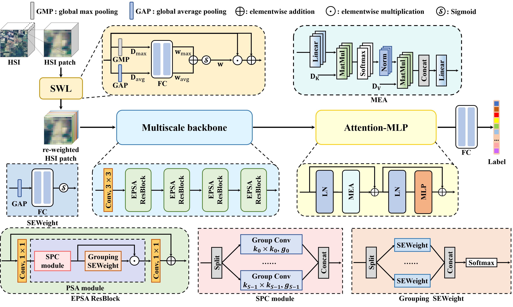

# CL-MGNet
Pytorch code for [Category-Level Band Learning-Based Feature Extraction for Hyperspectral Image Classification](https://ieeexplore.ieee.org/document/10360444), IEEE TGRS.

[Ying Fu](https://ying-fu.github.io/), Hongrong Liu, Yunhao Zou, Shuai Wang, Zhongxiang Li, and Dezhi Zheng.

## Introduction
In this paper, we propose a novel HSI classification framework named CL-MGNet, which can fully exploit the category-specific properties in spectral bands and obtain features with multiscale spatial information and global spectral properties.



## Code
### Prerequisite
- python 3.7
- pytorch 1.8.2
- numpy
- scikit-learn
- matplotlib
- scipy
### Prepare datasets
1. Download HSI datasets [[GoogleDrive](https://drive.google.com/drive/folders/1ThAcJscv0FotmLTvt4Af_pHe9zaH3KFI?usp=sharing)];
2. Place the downloaded HSI dataset in the "data" folder.
### Train and Test
Take Houston2018 dataset as example.
```python3
  python train.py --dataset Houston2018 --tr_percent 0.10 --epochs 500 --lr 1e-3 --spatialsize 13
```

## Citation
If you find this work useful for your research, please cite: 
```
@ARTICLE{10360444,
  author={Fu, Ying and Liu, Hongrong and Zou, Yunhao and Wang, Shuai and Li, Zhongxiang and Zheng, Dezhi},
  journal={IEEE Transactions on Geoscience and Remote Sensing}, 
  title={Category-Level Band Learning-Based Feature Extraction for Hyperspectral Image Classification}, 
  year={2024},
  volume={62},
  number={},
  pages={1-16},
  doi={10.1109/TGRS.2023.3340517}}
```
